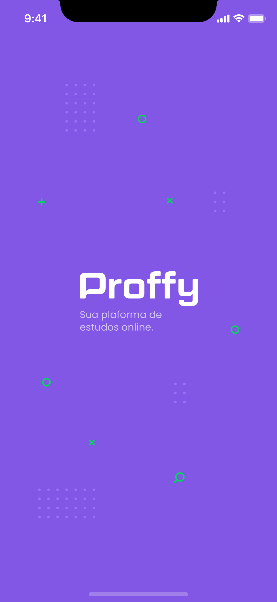

<h1 align="center">
  
  
  
  
</h1>

Aplicação para interconectar alunos que buscam professores de forma online. 

#

### Features
- [x] Listagem de professores disponíveis
- [x] Listagem de professores favoritos
- [x] Filtro por dia, hora e matéria

#

### Tecnologias
- [React](https://pt-br.reactjs.org/)
- [React-native](https://pt-br.reactjs.org/)
- [TypeScript](https://pt-br.typescriptlang.org/)
- [Expo](https://expo.io/)

#

### Autor

 
<b>Elves Brito</b>

